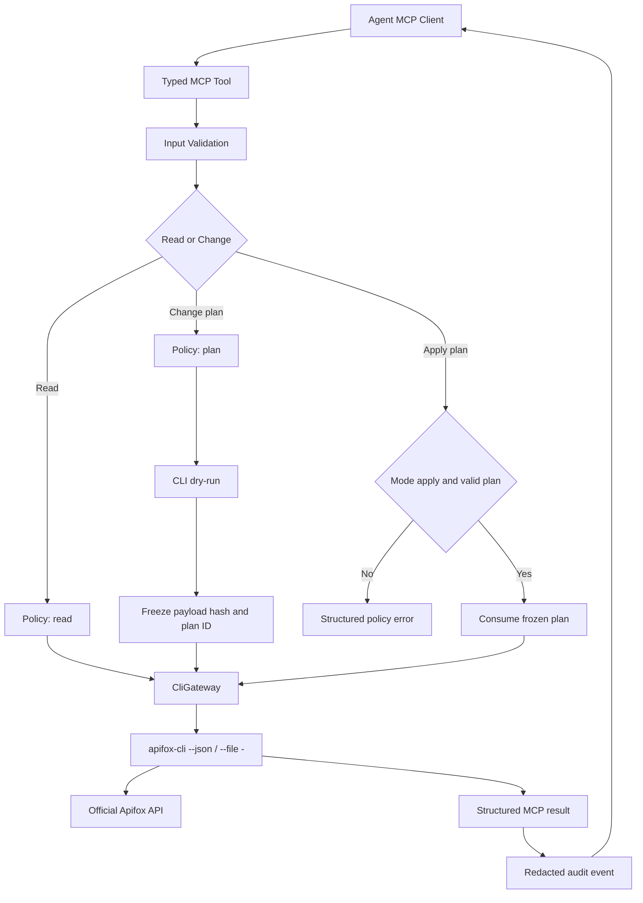

# 企业级 Agent MCP 开发文档

> 日期：2026-08-03
> 任务类型：重构
> 复杂度：复杂
> 状态：已完成
> 验证：已完成本机 LiveExternal 只读与 dry-run 验证，未执行 apply
> 关联分支/路径：Git: `main`
> 关联版本：`1e518bf`
> 前置文档：无
> 文档模式：Standard

---

## 一、需求说明

### 背景

仓库当前同时包含 Go CLI 和一套 Python MCP。现有项目方向把 Go CLI 定义为主入口，并把旧 Python MCP 视为兼容面（`README.md:7`、`AGENTS.md` 的 Project Direction）；用户本次明确要求把项目优化为“企业级、方便 Agent 调用的 MCP”。

旧 MCP 已注册 22 个工具，但大部分工具直接返回面向人的字符串，依赖模块级全局配置，并通过同步 `requests` 直接调用 Apifox（`apifox_mcp/config.py:24-40`、`apifox_mcp/utils.py:106-164`）。写工具没有统一 dry-run、写策略、结构化错误、调用审计和并发治理，MCP 与 Go CLI 还各自维护了一套 Apifox/OpenAPI 行为，存在长期漂移风险。Dockerfile 只支持 stdio，并在镜像构建时安装未固定上界的 MCP 依赖（`Dockerfile:27-37`）。

### 目标

- [x] 将 Python MCP 升级为 Agent 可稳定发现、调用和解析的正式产品入口。
- [x] 保留 Go CLI 作为唯一 Apifox 行为执行核心，MCP 不再复制 HTTP/OpenAPI 业务逻辑。
- [x] 对读取、计划和真实写入建立服务端强制策略，而不只依赖提示词或 ToolAnnotations。
- [x] 提供结构化输入/输出、统一错误码、请求关联 ID、脱敏审计和可重复测试。
- [x] 默认支持本地 stdio；为受控 Streamable HTTP 部署预留认证和 Host/Origin 防护。

### 范围

- ✅ 包含：MCP 服务工厂、CLI gateway、Pydantic 契约、写策略、计划令牌、审计、stdio/HTTP 传输、测试、Docker/CI/文档。
- ✅ 包含：现有接口、Schema、标签、审计、批量文档能力的 Agent 友好工具面。
- ✅ 包含：旧直连工具删除和迁移说明。
- ❌ 不包含：绕过 Go CLI 直接新增 Apifox 私有 API 调用。
- ❌ 不包含：实现 Apifox 公开 API 当前不支持的接口/Schema/目录删除。
- ❌ 不包含：本阶段自建 OAuth 授权服务器或把 MCP 暴露到公网。
- ❌ 不包含：数据库、缓存或业务数据迁移。

### 判断依据、明确假设与待确认

| 类型 | 内容 | 依据 | 处理口径 |
|------|------|------|----------|
| 事实 | Go CLI 已有结构化 `--json`、stdin、validation、dry-run 和批处理契约 | `README.md:57-101`；`internal/apifoxcli/cli.go:2257-2290` | MCP 通过子进程复用 CLI，不复制业务实现 |
| 事实 | 现有 Python MCP 有 22 个字符串型工具且没有 Python 测试 | `apifox_mcp/tools/*.py` 的 `@mcp.tool()`；仓库无 `tests/**/*.py` | 重建正式工具面并增加契约测试 |
| 事实 | MCP Python SDK v2 支持结构化输出、ToolAnnotations、Context、lifespan、stdio/Streamable HTTP 和内存客户端测试 | MCP Python SDK v2 官方文档：`py.sdk.modelcontextprotocol.io/v2` | 使用 SDK v2 能力，不自行包装协议帧 |
| 假设 | 第一生产场景是本地 Agent 通过 stdio 调用 | 用户强调 Agent 调用，未要求公网多租户 | stdio 默认启用；HTTP 默认关闭 |
| 假设 | 企业远程部署由既有 IdP/网关提供 OAuth/OIDC | 本阶段没有企业 IdP、issuer、scope 信息 | 仅提供 TokenVerifier/网关集成点；无认证禁止非 loopback 绑定 |
| 需求冲突（已裁决） | 旧口径：Python MCP 仅为 legacy；最终口径：MCP 成为正式 Agent 门面，Go CLI 仍是执行核心；实现禁令：不得恢复 MCP 内第二套 Apifox HTTP 业务逻辑 | 用户本轮明确要求 + `README.md:7` | conflicts(status=resolved)；同步更新 `AGENTS.md`、README 和发布说明 |
| 未确认项 | 后续远程部署采用哪家 IdP、具体 scopes 和审计汇聚平台 | 当前无企业部署信息 | 不阻塞本地 stdio 与安全 HTTP 基座；部署前再配置 |

---

## 二、技术方案

### 方案概述

把 MCP 重构为 Go CLI 的受控适配层：Agent 调用强类型 MCP 工具，MCP 校验参数和权限、生成 dry-run 计划、通过 stdin 调用 `apifox-cli --json`，再把 CLI JSON 转为统一结构化 MCP 结果并写入脱敏审计日志。

### 核心设计

#### 1. 单一执行核心

- `CliGateway` 只用 `asyncio.create_subprocess_exec` 调用绝对路径二进制，禁止 shell 拼接。
- JSON 规格通过 stdin 传给 CLI 的 `--file -`，Token 和 Project ID 只进入子进程环境，不进入命令行或临时文件。
- 子进程设置超时、最大输入/输出、并发信号量和环境变量白名单。
- CLI 的退出码、stderr 和 JSON 输出转换成稳定 `McpError`，保留 Apifox 原始错误摘要但先脱敏。

#### 2. Agent 友好的工具目录

工具名稳定、动词明确、避免同义重复。第一阶段正式工具：

| 工具 | 类型 | CLI 映射 | 说明 |
|------|------|----------|------|
| `apifox_project_check` | 只读 | `config check` | 返回连接、项目和能力状态，不返回 Token |
| `apifox_project_overview` | 只读 | `overview --json` | 单次导出返回接口/路径/模型/标签计数和受限样本 |
| `apifox_api_list` | 只读 | `api list --json` | 支持 keyword/limit，返回结构化接口摘要 |
| `apifox_api_get` | 只读 | `api get --json` | 返回完整 operation |
| `apifox_schema_list` / `apifox_schema_get` | 只读 | `schema list/get --json` | 查询模型 |
| `apifox_tag_list` / `apifox_tag_apis` | 只读 | `tag list/apis --json` | 盘点分类 |
| `apifox_audit` | 只读 | `audit responses/all-responses/path-naming/consistency --json` | 统一审计入口，使用判别联合参数 |
| `apifox_change_plan` | 计划 | 对写命令强制追加 `--dry-run` | 支持 endpoint/schema/tags/docs/crud，返回 plan ID、操作摘要和过期时间 |
| `apifox_change_apply` | 写入 | 执行计划中已冻结的 CLI 参数和 payload | 只接收 plan ID，不允许再次传 payload |
| `apifox_export_openapi` | 只读 | `export-openapi` | 返回结构化内容或受控输出，不写任意路径 |

旧 22 个字符串工具及其 Python 直连 HTTP 实现直接删除，不在正式 MCP 中保留运行时兼容开关；迁移兼容由上一版本 tag 和 Go CLI 承接，避免无测试旧代码继续扩大安全面。

#### 3. 写入策略与计划令牌

- `APIFOX_MCP_WRITE_MODE=disabled|plan|apply`，默认 `plan`。
- `disabled`：不注册或拒绝所有计划/写入；`plan`：允许 dry-run，拒绝 apply；`apply`：允许提交有效 plan。
- `apifox_change_plan` 对 canonical command、payload hash、project ID、创建时间和 TTL 生成不可变计划，默认 10 分钟过期。
- `apifox_change_apply` 只能按 plan ID 读取服务端冻结内容；项目、payload、写模式或 CLI 版本变化时拒绝执行。
- 同一 plan 只允许成功消费一次；失败是否可重试由结构化 `retryable` 决定。
- ToolAnnotations 只作为客户端提示；真正权限检查始终在服务端策略层执行。

#### 4. 结构化契约

所有工具返回对象，不返回自由文本作为唯一结果：

```json
{
  "ok": true,
  "request_id": "req_...",
  "tool": "apifox_api_list",
  "project_id": "masked-or-logical-id",
  "mode": "read",
  "data": {},
  "error": null,
  "meta": {"duration_ms": 12, "cli_version": "..."}
}
```

错误对象固定包含 `code`、`message`、`retryable`、`exit_code`、`apifox_status` 和可选 `details`。Token、Authorization、Cookie、URL credentials、输入 payload 原文不得进入输出或日志。

#### 5. MCP 服务器与传输

- 使用 SDK v2 server factory + lifespan 注入 `Settings`、`CliGateway`、`PlanStore`、`AuditLogger`。
- 每个工具声明强类型参数、返回类型和 ToolAnnotations：读取工具 `readOnlyHint=true`；计划工具不写外部系统；apply 工具 `destructiveHint=true`，upsert 类按实际语义声明 idempotency。
- stdio 为默认传输，协议 stdout 禁止普通日志；日志写 stderr 或 JSONL 文件。
- Streamable HTTP 仅在显式 `--transport streamable-http` 下启用；默认绑定 `127.0.0.1`。
- 非 loopback 绑定必须同时配置 TokenVerifier/AuthSettings、allowed hosts 和 allowed origins，否则启动失败；开启 DNS rebinding protection。
- 首版保持有状态 HTTP，以支持一次性 plan；stateless 模式不进入第一阶段。

#### 6. 可观察性与审计

- 每次调用记录 request ID、client ID（可用时）、tool、mode、project ID、payload hash、结果、耗时、CLI exit code。
- 不记录 Token、完整请求/响应 Schema、示例业务数据和 CLI stdin。
- 审计写入 stderr 或配置的 append-only JSONL；写日志失败必须显式上报，真实写入前审计 sink 不可用时 fail closed。
- 使用结构化结果返回计划/执行状态；不使用已被 SDK v2 废弃的 MCP logging capability。

### AI 执行口径

- **前置条件**：先读本文档、`AGENTS.md`、`internal/apifoxcli/cli.go`、`skills/apifox-cli/SKILL.md` 和当前 Python MCP 入口；确认 MCP SDK v2 的实际安装 API 与 Context7 证据一致。
- **执行顺序**：先建立 models/settings/error → CLI gateway 与测试 → policy/plan store 与测试 → MCP server/tools 与内存客户端测试 → transport/entrypoint → Docker/CI/docs → 删除旧直连实现。
- **验收标准**：无凭据可完成工具发现；读工具输出符合 schema；默认模式无法真实写入；plan/apply payload hash 不一致、过期或重复消费均失败；stdio stdout 无日志污染；全部 Hermetic 测试通过。
- **禁止改动**：不得把 Token 放入命令行、JSON spec、MCP 结果或日志；不得使用 `shell=True`；不得让 MCP 直接调用 Apifox HTTP；不得实现公开 API 不支持的删除；不得把 LiveExternal 测试混入默认 CI。

### 最小影响分析（开闭原则）

- **新增内容**：settings、models、errors、CLI gateway、policy、plan store、audit、server factory 和 Python tests。
- **不变内容**：`cmd/apifox-cli` 和 `internal/apifoxcli` 的已有命令语义；Apifox 官方 import/export 路径。
- **必须修改**：Python MCP 入口/配置/依赖、Docker/CI/README/AGENTS；否则无法从 legacy 切换为正式入口并形成一致发布契约。

### MCP 契约影响分类

| MCP 工具面 | 分类 | 契约是否变化 | 兼容性说明 |
|------------|------|--------------|--------------|
| 新正式工具目录 | 新增接口 | 是 | Agent 获取结构化输出和 annotations |
| 旧 22 个字符串工具 | 删除接口 | 是 | 新版本不再注册；上一版本 tag 和 Go CLI 提供迁移回滚路径 |
| stdio 启动 | 行为变更 | 是 | 入口仍为 `python -m apifox_mcp.main`/console script，日志行为更严格 |
| Streamable HTTP | 新增接口 | 是 | 仅受控启用，不默认公网开放 |

---

## 三、代码变更清单

| 文件路径 / 变更对象 | 变更类型 | 说明 |
|----------|----------|------|
| `AGENTS.md` | 修改 | 将 MCP 定义为 Agent 正式门面、CLI 定义为唯一执行核心；现有规则无法表达新产品方向 |
| `pyproject.toml`, `uv.lock` | 修改 | 固定 MCP SDK v2 兼容范围，增加 pytest/anyio 测试依赖和 `apifox-mcp` console script |
| `apifox_mcp/settings.py` | 新增 | 强类型加载传输、CLI、写策略、限额和审计配置 |
| `apifox_mcp/models.py`, `apifox_mcp/errors.py` | 新增 | MCP 输入/输出、计划和稳定错误契约 |
| `apifox_mcp/cli_gateway.py` | 新增 | 安全异步调用 Go CLI、stdin JSON、超时/限额/脱敏 |
| `apifox_mcp/policy.py`, `apifox_mcp/plans.py` | 新增 | 写模式、冻结计划、TTL、一次性消费和 payload hash |
| `apifox_mcp/audit.py` | 新增 | stderr/JSONL 脱敏审计与 fail-closed 写入前检查 |
| `apifox_mcp/server.py` | 新增 | SDK v2 server factory、lifespan、正式工具注册和 annotations |
| `apifox_mcp/main.py`, `apifox_mcp/config.py` | 修改 | 新 transport/启动参数；移除 import-time 全局客户端和普通 stdout 日志 |
| `apifox_mcp/tools/*`, `apifox_mcp/utils.py`, `apifox_mcp/config.py` | 删除 | 移除已被正式 gateway 取代的旧直连 HTTP 实现和字符串工具 |
| `cmd/apifox-mcp/main.go` | 删除 | 移除与真正 MCP 命令冲突、仅重复 Go CLI 的旧别名 |
| `tests/test_cli_gateway.py` | 新增 | 子进程参数、stdin、超时、输出限额、错误和脱敏测试 |
| `tests/test_policy.py`, `tests/test_plans.py` | 新增 | disabled/plan/apply、过期、篡改、重复消费测试 |
| `tests/test_server.py` | 新增 | SDK 内存客户端测试工具发现、schema、annotations 和结构化结果 |
| `Dockerfile` | 修改 | Go 多阶段构建 CLI + Python MCP runtime，非 root 用户、固定依赖、health/smoke 检查 |
| `.github/workflows/ci.yml` | 修改 | 保留 Go 测试并增加 Python lint/type/test、MCP discovery smoke test、Docker build |
| `README.md`, `skills/apifox-cli/SKILL.md` | 修改 | MCP/CLI 双入口、Agent 配置、写策略、迁移和生产安全说明 |

---

## 四、流程图



---

## 五、测试要点

### 验收标准

- [ ] `uv run pytest` 在无 Apifox Token、无网络环境通过全部 Hermetic 测试。
- [ ] SDK 内存客户端能列出正式工具，并校验每个工具的 input/output schema 与 annotations。
- [ ] `APIFOX_MCP_WRITE_MODE=plan` 下任何 apply 都返回 `WRITE_DISABLED`，且未启动真实 CLI 写命令。
- [ ] apply 只执行服务器冻结的 plan；篡改、过期、跨项目和重复消费返回稳定错误码。
- [ ] 子进程命令不含 Token，stdin 不落盘，日志中不出现测试 Token 和业务 payload。
- [ ] stdio smoke test 的 stdout 只包含 MCP 协议输出。
- [ ] HTTP 在无认证且非 loopback 配置时启动失败；Host/Origin 检查有测试。
- [ ] Go CLI 原有 `go test ./...` 与 smoke test 保持通过。

### 单元测试

- TestDependencyClass：`Hermetic`。
- 使用假的 CLI 可执行文件/进程适配器，不访问 Apifox、不依赖真实凭据。

### 集成测试

- SDK 内存客户端：`Hermetic`。
- Docker/stdio discovery smoke：`Hermetic`。
- 真实 Apifox 沙箱验证：`LiveExternal`，独立手动 profile/job，默认 CI 禁用，只使用专用低权限项目和短期 Token。

### 边界与异常

- [ ] CLI 不存在、版本不兼容、退出码 1/2、输出非 JSON、stderr 超长。
- [ ] payload 超限、超时、并发满载、计划过期、重复 apply。
- [ ] Token/Authorization/Cookie/URL credentials 的多种错误文本脱敏。
- [ ] audit sink 失败时读取可继续、真实写入 fail closed。
- [ ] Agent 取消、MCP 客户端断连时终止或回收子进程。

---

## 六、风险与注意事项

| 风险点 | 影响等级 | 应对措施 |
|--------|----------|----------|
| MCP SDK v1.24 到 v2 存在 API 迁移 | 高 | 固定版本范围；先做最小 server/client spike 和契约测试 |
| MCP 与 CLI 版本不匹配 | 高 | 启动时读取 `apifox-cli --version`，设最小兼容版本并返回明确错误 |
| Agent 自动调用真实写工具 | 高 | 默认 plan-only、服务端 plan TTL/一次性消费、apply 模式显式配置、ToolAnnotations 双重提示 |
| 子进程或日志泄露 Token/业务数据 | 高 | env allowlist、命令行禁 Token、结构化脱敏测试、stdio 日志隔离 |
| 远程 HTTP 暴露带来未授权访问 | 高 | 默认关闭；无 verifier 禁止非 loopback；DNS rebinding、Host/Origin 白名单 |
| 旧 MCP 客户端迁移失败 | 中 | 提供新旧工具迁移表；必要时回滚上一版本 tag，不在新版本保留直连代码 |
| 22 个旧工具删除后 Agent 行为改变 | 中 | 新工具语义测试、工具描述示例和发布说明明确破坏性变化 |

---

## 七、上线计划

- **依赖项**：兼容的 `apifox-cli` 二进制、MCP Python SDK v2、Python 3.12+；远程部署另需企业 IdP/网关。
- **回滚方案**：保留旧镜像/tag 供短期迁移回滚；MCP 出问题时 CLI 仍可独立使用，不在新版本重新启用旧直连代码。
- **灰度策略**：先发布 stdio + plan-only；再对测试项目开放 apply；最后才启用受认证 HTTP。
- **监控指标**：工具调用量、失败码、CLI 超时、计划/应用比、过期计划、脱敏审计写入失败、按 client/tool 的写入次数。

---

## 八、实现 Todo

- [x] 在 `pyproject.toml` 固定 MCP SDK v2 兼容范围并加入 pytest/anyio、console script，更新 lock。
- [x] 新增 `Settings`、结构化 result/error models，并验证任何输出都不含凭据。
- [x] 新增 `CliGateway`，用 stdin 和 `create_subprocess_exec` 安全复用 CLI，覆盖超时/限额/取消。
- [x] 新增 write policy、plan store 和 audit logger，完成 plan-only 默认行为。
- [x] 新增 MCP server factory 和正式工具目录，补充 annotations 和结构化结果。
- [x] 实现 stdio 默认启动和受控 Streamable HTTP 启动门禁。
- [x] 删除旧工具、旧全局配置、Python 直连 HTTP 工具层和冲突的 Go 命令别名。
- [x] 更新 Dockerfile，把 Go CLI 与 Python MCP 打进非 root 镜像。
- [x] 更新 CI，运行 Go 测试、Python Hermetic 测试、MCP discovery smoke 和 Docker build。
- [x] 更新 `AGENTS.md`、README 和 Skill，写明双入口、权限模型、配置示例和迁移期。
- [x] 执行 Python/Go 测试、MCP discovery smoke，并在用户授权项目完成只读查询和 dry-run；未执行 apply。

---

## 九、代码评审关注点

- **重点检查**：是否存在绕过 policy 的写路径；plan 与 apply 是否绑定相同 payload/project/CLI 版本；子进程和错误文本是否彻底脱敏；stdio stdout 是否被日志污染。
- **回归风险**：CLI 参数映射、旧 MCP 工具迁移、Windows 子进程行为、SDK v2 transport 配置。
- **不要改的**：不要重写 `internal/apifoxcli` 已有命令语义；不要新增私有 Apifox API；不要在默认测试中访问真实 Apifox。

---

## 十、参考资料

- MCP Python SDK v2 Structured Output：<https://py.sdk.modelcontextprotocol.io/v2/servers/structured-output>
- MCP Python SDK v2 Server API：<https://py.sdk.modelcontextprotocol.io/v2/api/mcp/server>
- MCP Python SDK v2 Streamable HTTP：<https://py.sdk.modelcontextprotocol.io/v2/api/mcp/server/lowlevel>
- MCP Python SDK v2 Transport Security：<https://py.sdk.modelcontextprotocol.io/v2/api/mcp/server/transport_security>

---

## 十一、实施结果

### 已完成

- 正式 MCP 已改为 `MCPServer` v2 强类型工具面，读取、计划、应用能力分离。
- `CliGateway` 已通过 stdin 调用 Go CLI，并具备超时、输入/输出限额、并发限制、取消回收和凭据脱敏。
- 写策略默认 `plan`；计划绑定 project、CLI 版本、payload hash、TTL 和一次性消费状态。
- stdio 默认启动；Streamable HTTP 对非 loopback 强制认证、Host 和 Origin 配置。
- 旧 Python 直连 HTTP 层、22 个字符串工具、`requests` 依赖和冲突的 Go `apifox-mcp` 别名已删除。
- Dockerfile、CI、README、AGENTS 和 CLI Skill 已同步为 MCP + CLI 双入口。
- LiveExternal 实测后修正配置检查假成功、接口/路径计数混淆和 `info.title` 字段语义；新增单次导出的项目概览工具与 `VALIDATION_FAILED` 分类。
- 正式发布改为平台专用 bundled wheel：Windows/Linux/macOS 的 x64/ARM64 wheel 各自内置一个 Go CLI，运行时优先自动发现内置二进制，最终用户无需安装 Go。
- release workflow 校验 wheel 平台标签、唯一 CLI 文件、非空内容和 Unix 可执行权限，再把产物附加到 GitHub Release；源码开发仍允许 `APIFOX_CLI_PATH` 覆盖。
- 新增 Windows x64 npm 分发：`@yanzhang123/apifox-mcp` 内含 PyInstaller 冻结的 MCP 和 Go CLI 两个 exe，Node 启动器绑定 CLI 路径并透传 stdio；用户运行时无需 Python、uv 或 Go。
- Windows CI 和 tag release 会执行 npm pack、独立安装、冻结 MCP 协议发现；`main` push 的 CI 全绿后由独立 workflow 自动发布尚未存在的新版本，并通过 npm Trusted Publishing（GitHub OIDC）避免长期 `NPM_TOKEN`。

### 验证结果

| 命令 | TestDependencyClass | 结果 |
|------|---------------------|------|
| `uv run ruff check apifox_mcp tests` | Hermetic | 通过 |
| `.venv\\Scripts\\pytest.exe -q` | Hermetic | 17 passed |
| Windows bundled wheel build + isolated import/CLI smoke | Hermetic | 通过，自动发现 wheel 内 `apifox-cli.exe` |
| Windows npm `.tgz` install + frozen stdio discovery | Hermetic | 通过，12 个 MCP 工具可发现 |
| CI/release workflow YAML parse | Hermetic | 通过 |
| `uv run apifox-mcp --help` | Hermetic | 通过，stdio/Streamable HTTP 参数可见 |
| `go test ./...`（官方便携 Go 1.26.3） | Hermetic | 通过 |
| `docker build -t apifox-mcp:test .` | Hermetic | 未运行：当前主机未安装 Docker；已加入 CI |
| 真实 Apifox 项目 | LiveExternal | 连接、概览、接口/模型/标签读取和 endpoint upsert dry-run 通过；未执行 apply |
